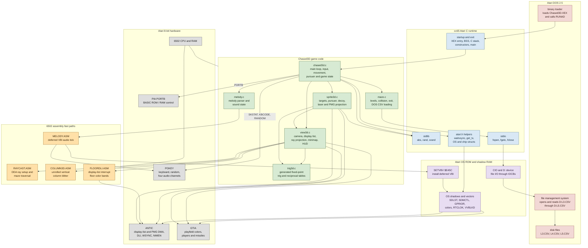
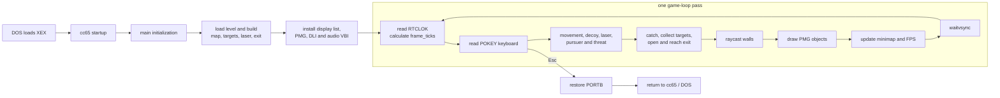
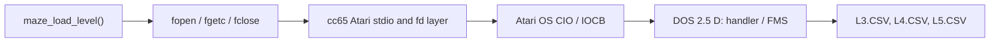
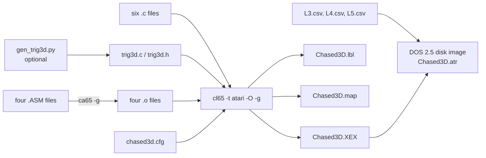

# Chased3D program map

This map shows which parts of Chased3D are game code, cc65 runtime support,
Atari OS services, DOS 2.5 services, and direct hardware access.

## Layer map



Arrows into the hardware layer mean direct memory-mapped access. Arrows through
the OS or DOS layers mean a service call or an OS-maintained shadow register.
The game does not use CIO for keyboard input; it reads POKEY directly so held
keys are visible without the OS key-repeat delay.

## Main-loop map



The VBI audio routine runs asynchronously even when rendering takes several
vertical blanks. The DLI runs at selected floor scanlines, independently of
both the game loop and the VBI.

```mermaid
sequenceDiagram
    participant Loop as C main loop
    participant OS as Atari OS VBI
    participant Audio as MELODY.ASM
    participant ANTIC as ANTIC display DMA
    participant Floor as FLOORDLI.ASM
    participant POKEY as POKEY audio

    Loop->>Loop: update and render frame
    ANTIC-->>Floor: DLI at floor-band boundary
    Floor->>ANTIC: WSYNC then write COLPF0
    OS-->>Audio: deferred VBI vector 7
    Audio->>POKEY: update AUDF1-4 and AUDC1-4
    Audio-->>OS: chain to saved deferred VBI
    Loop->>OS: waitvsync()
```

## Source responsibilities

| Part | Responsibility | Important boundary |
| --- | --- | --- |
| [`chased3d.c`](chased3d.c) | Program entry, frame timing, keyboard, player and pursuer simulation, level transitions | Reads POKEY and PIA directly; uses OS jiffy clock |
| [`maze.c`](maze.c) | 20 x 59 tile map, embedded levels 1-2, CSV levels 3-5, collision and exit state | Uses cc65 stdio, which reaches DOS through CIO |
| [`view3d.c`](view3d.c) | 18-ray renderer, display list, frame buffer, minimap, HUD and floor motion | Calls the DDA, blitter and DLI assembly routines; configures ANTIC and color shadows |
| [`sprite3d.c`](sprite3d.c) | Object placement and projection, wall occlusion, Player/Missile graphics | Writes ANTIC and GTIA registers plus PMG RAM |
| [`melody.c`](melody.c) | Converts melody strings to frequency and duration arrays | Shares state with the interrupt-driven assembly player |
| [`trig3d.c`](trig3d.c) | 8.8 sine, reciprocal, ray-angle and fisheye-correction tables | Generated by [`gen_trig3d.py`](gen_trig3d.py) |
| [`RAYCAST.ASM`](RAYCAST.ASM) | Fixed-point ray setup and DDA wall traversal | Reads C maze row-pointer tables directly |
| [`COLUMN3D.ASM`](COLUMN3D.ASM) | Self-modifying, unrolled screen-column fill | Writes the C-owned frame buffer directly |
| [`FLOORDLI.ASM`](FLOORDLI.ASM) | Six rotating floor luminance bands | Owns the DLI vector and writes `WSYNC` / `COLPF0` |
| [`MELODY.ASM`](MELODY.ASM) | Melody, threat and laser audio ticks | Installs through OS `SETVBV`, then writes POKEY directly |
| [`chased3d.cfg`](chased3d.cfg) | XEX format, segment placement, alignment, stack and DOS reservation | Keeps video RAM under the disabled BASIC ROM |
| [`build_chased3d.ps1`](build_chased3d.ps1) | Assembles four assembly files and links all C modules | Produces the XEX, label file and linker map |

## Runtime, OS, and DOS boundaries

### cc65 C runtime

The `-t atari` runtime supplies the XEX startup and exit path, the software C
stack, `waitvsync()`, `get_tv()`, `rand()` / `srand()`, and stdio. Function
locals normally live on cc65's software stack, which is why the renderer keeps
hot per-ray values in static storage. The linker configuration reserves a 1 KB
stack immediately below `$A000`.

The runtime is also the adapter between ISO C file calls and Atari I/O:



### Atari OS

The program deliberately mixes OS cooperation with direct hardware access:

| OS location/service | Use |
| --- | --- |
| `RTCLOK` low byte `$0014` | Elapsed jiffies, speed scaling and FPS timing |
| `VDSLST` `$0200` | DLI vector used by the floor color routine |
| `VVBLKD` `$0224` | Existing deferred VBI saved and chained by the audio routine |
| `SDMCTL`, `SDLST`, `GPRIOR`, color shadows | OS-side copies of ANTIC/GTIA display state |
| `NOCLIK` `$02DB` | Disables the OS keyboard click |
| `SETVBV` `$E45C` | Atomically installs deferred VBI vector 7 |
| CIO | Used indirectly by cc65 stdio for `D:` level files |

### DOS 2.5

DOS has two roles. First, its binary loader reads `Chased3D.XEX`, processes the
load segments, and jumps through the XEX run address to cc65 startup. Second,
while the game runs, DOS's resident file-management system services the `D:`
device requests used for levels 3-5. Levels 1 and 2 need no disk access because
they are generated from embedded data.

The program itself does not call DOS menu or DUP commands. DOS remains below
the game in memory and is reached only through the normal OS CIO path.

## Hardware register map

| Chip | Registers used | Purpose |
| --- | --- | --- |
| POKEY | `AUDF1-AUDF4` / `AUDC1-AUDC4` `$D200-$D207`, `AUDCTL` `$D208` | Four-channel melody, threat tone and laser noise |
| POKEY | `KBCODE` `$D209`, `RANDOM` `$D20A`, `SKSTAT/SKCTL` `$D20F` | Continuous keyboard polling, random seed and keyboard/audio initialization |
| GTIA | `HPOSP0-3` `$D000-$D003`, missile positions `$D004-$D007`, sizes `$D008-$D00C` | Positions and scales billboards and the decoy |
| GTIA | `GRACTL` `$D01D`, `PRIOR` `$D01B`, `COLPF0` `$D016`, player/playfield colors | Enables PMG and selects priorities and colors |
| ANTIC | `DMACTL` `$D400`, `PMBASE` `$D407`, `WSYNC` `$D40A`, `NMIEN` `$D40E` | Display/PMG DMA, aligned PMG base, DLI timing and interrupt enable |
| PIA | `PORTB` `$D301` | Exposes RAM at `$A000-$BFFF` by disabling BASIC ROM |

## Memory map

The addresses below come from [`chased3d.cfg`](chased3d.cfg). Exact used ends
move as code changes; [`Chased3D.lbl`](Chased3D.lbl) and the generated
`Chased3D.map` are the authoritative build outputs.

```text
$0000 +------------------------------+
      | OS zero page                 |
$0082 +------------------------------+
      | cc65 ZEROPAGE / EXTZP        |  $0082-$00FF
$0100 +------------------------------+
      | CPU hardware stack           |
$0200 +------------------------------+
      | OS vectors and shadow RAM    |
$0600 +------------------------------+
      | PAGE6 DLI code/data/BSS       |  $0600-$06FF
$0700 +------------------------------+
      | DOS 2.5 and OS-managed RAM   |
$1C20 +------------------------------+
      | DOS-reserved boundary        |
$4000 +------------------------------+
      | XEX startup, game code,      |
      | tables, data and ordinary BSS|
$9C00 +------------------------------+
      | 1 KB cc65 software C stack   |  grows downward toward $9C00
$A000 +------------------------------+
      | SCREEN, DLIST, PMGRAM,        |  RAM exposed beneath BASIC ROM
      | HIGHBSS                      |
$C000 +------------------------------+
      | OS ROM / hardware windows    |
$FFFF +------------------------------+
```

The screen segment is 4 KB aligned because ANTIC playfield DMA cannot cross a
4 KB boundary. The display list and PMG storage are 1 KB aligned for their
respective ANTIC addressing rules. `main()` saves `PORTB`, enables the RAM
beneath BASIC, and restores `PORTB` before returning to DOS.

## Build map

