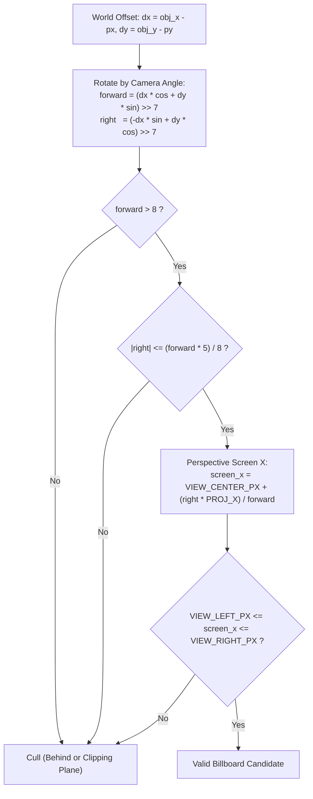
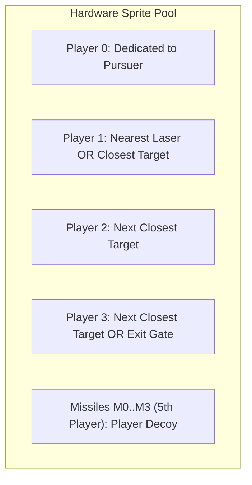

# 3D Billboard Sprites using Atari Player-Missile Graphics (PMG)

This document explains the technical implementation of pseudo-3D billboard sprites in Chased3D on the Atari 8-bit computers (Atari 800XL / 130XE), utilizing the GTIA/ANTIC Player-Missile Graphics hardware overlay.

---

## 1. Why PMG for 3D Billboards?

In pseudo-3D engines such as *Wolfenstein 3D* on the PC, sprites (enemies, pick-ups, projectiles) are rendered into the framebuffer using software scaling, transparent color masking, and depth sorting.

On an 8-bit MOS 6502 CPU ($1.79\text{ MHz}$):
* **Framebuffer Overhead**: The 3D view uses ANTIC Mode D ($160 \times 96$, 4 colors, 2 bits per pixel). Drawing a masked software sprite requires reading each framebuffer byte, applying an AND mask, bitwise OR-ing the shifted sprite pattern, and writing it back across a 40-byte scanline stride.
* **Overdraw Penalties**: The wall renderer in [COLUMN3D.ASM](COLUMN3D.ASM) writes whole bytes once using unrolled absolute stores (`sta abs,x`). Modifying pixels after the wall pass destroys this fast write-only pipeline.
* **Color Limitations**: ANTIC Mode D allows only 4 colors for the entire playfield (background, floor, and two wall luminance shades). Software sprites would be forced to share these wall and floor colors.

### The PMG Solution

The Atari 8-bit video architecture includes a dedicated hardware sprite generator in GTIA and ANTIC:
1. **Zero-Cycle Video Compositing**: ANTIC and GTIA composite players and missiles over the playfield video signal in real time on the television raster beam. No framebuffer pixels are touched or dirtied.
2. **Independent Palettes**: Each player has an independent 8-bit color register (`PCOLR0`..`PCOLR3`), allowing targets (bright yellow `0x1E`), pursuers (orange-red `0x34`), lasers (bright green `0xC8`), and decoys to stand out against walls.
3. **Hardware Horizontal Scaling & Positioning**: Horizontal placement (`HPOSP0`..`3`) is cycle-accurate at single-color-clock precision ($0..255$), with hardware scaling (`SIZEP0`..`3`) for $1\times$, $2\times$, or $4\times$ width.
4. **Lightweight Vertical Blitting**: Since a player in single-line resolution is only 1 byte wide per scanline, scaling a billboard vertically requires writing just **one byte per row** into PMG memory.

```mermaid
flowchart LR
    A["Camera & World State"] --> B["Camera Space Transform (dx, dy)"]
    B --> C["Frustum & Near Plane Culling"]
    C --> D["Perspective Projection to Screen X"]
    D --> E["Depth Test against col_dist[col]"]
    E --> F["Hardware Width (SIZEPn) & Position (HPOSPn)"]
    F --> G["Vertical Software DDA Scale into pmg_ram"]
    G --> H["Hardware Overlay onto Mode D View"]
```



---

## 2. Atari PMG Architecture & Setup

### Memory Allocation & Alignment

In single-line resolution, Player-Missile Graphics requires a contiguous 1,024-byte ($0400) buffer that must be **1 KB aligned**. The high byte of this buffer is loaded into `ANTIC.pmbase`.

Chased3D places this buffer at `$B400` in reclaimed BASIC RAM (defined in [chased3d.cfg](chased3d.cfg) as segment `PMGRAM`):

```c
#pragma bss-name (push, "PMGRAM")
static unsigned char pmg_ram[1024];
#pragma bss-name (pop)
```

Within the 1,024-byte block, memory is segmented by ANTIC DMA:

```text
Offset          Size    Assignment
-----------------------------------------------------------
$0000 - $017F   384 B   Unused in single-line mode
$0180 - $01FF   128 B   Missiles (M0, M1, M2, M3: 2 bits each)
$0200 - $027F   128 B   Player 0 (Pursuer)
$0280 - $02FF   128 B   Player 1 (Target / Laser)
$0300 - $037F   128 B   Player 2 (Target)
$0380 - $03FF   128 B   Player 3 (Target / Exit Gate)
```

### Hardware Initialization ([sprite3d.c](sprite3d.c#L107-L138))

```c
ANTIC.pmbase = (unsigned char)((unsigned int)pmg_ram >> 8); // Base at $B4
OS.sdmctl = 0x2E;            // Enable Playfield + DL + Player + Missile DMA
ANTIC.dmactl = OS.sdmctl;
GTIA_WRITE.gractl = 0x03;     // Enable player & missile graphics in GTIA
OS.gprior = 0x11;            // Players over playfield (0x01) + 5th player (0x10)
GTIA_WRITE.prior = OS.gprior;
```

* **`GPRIOR = 0x11`**:
  * Bit 0 (`0x01`): Prioritizes all players in front of playfield colors 0, 1, 2, and 3.
  * Bit 4 (`0x10`): Combines the four 2-bit missiles into an 8-bit **5th Player**, inheriting the color of Playfield 3 (`COLPF3` / `COLOR3`). Chased3D uses this 5th player to draw the decoy billboard.

---

## 3. Projection & Frustum Culling

To place a 3D billboard on screen, its world coordinate $(X_{\text{obj}}, Y_{\text{obj}})$ is translated into camera-relative coordinates $(forward, right)$ using 8.8 fixed-point arithmetic in [sprite3d.c](sprite3d.c#L368-L417):



### 1. Distance & Rotation

```c
idx = (unsigned char)(angle >> 8);
cos_h = sin3d[(unsigned char)(idx + 64)] >> 1;
sin_h = sin3d[idx] >> 1;
dx = ((int)object_x - (int)px) >> 4;
dy = ((int)object_y - (int)py) >> 4;

forward = ((dx * cos_h) >> 7) + ((dy * sin_h) >> 7);
right   = ((-dx * sin_h) >> 7) + ((dy * cos_h) >> 7);
```

### 2. Near-Plane & Frustum Culling
* Objects behind the camera ($forward \le 0$) or closer than 8 units ($forward \le 8$) are rejected.
* Angular field of view ($60^\circ$) check: $|right| \le \frac{5 \cdot forward}{8}$.

### 3. Screen X Projection
$$\text{screen\_x} = \text{VIEW\_CENTER\_PX} + \frac{right \cdot \text{PROJ\_X}}{forward}$$
where $\text{PROJ\_X} = 121 \approx \frac{\text{viewport\_width} / 2}{\tan(30^\circ)}$.

---

## 4. Occlusion: Depth Testing against the Raycaster

Because players are prioritized in front of playfield graphics (`GPRIOR = 0x11`), a billboard would show through solid maze walls if drawn naively.

Chased3D solves this by depth testing against the raycaster's 1D depth buffer:

1. During the wall casting pass, [view3d.c](view3d.c#L173) records the perpendicular distance to the closest wall in each of the 18 columns:
   ```c
   col_dist[col] = ray_dist;
   ```
2. During sprite projection in [sprite3d.c](sprite3d.c#L407-L409), the projected screen X is mapped to its ray column:
   ```c
   column = (unsigned char)((screen_x - VIEW_LEFT_PX) >> 3);
   projected_dist = (unsigned int)forward << 4;
   if (projected_dist > col_dist[column]) return 0; // Occluded by wall!
   ```

If the wall is closer than the billboard, the object is immediately culled before any PMG registers or memory are touched.

---

## 5. Hardware Allocation & Candidate Sorting

Because the Atari 8-bit has only 4 hardware players, a maze containing up to 24 targets, 4 lasers, an exit gate, and an active pursuer requires strict priority management:



### Distance-Sorted Insertion ([sprite3d.c](sprite3d.c#L346-L366))

Visible targets are inserted into a fixed-capacity candidate list (`cand_dist[]`, `cand_x[]`, etc.) sorted from nearest to furthest:
* Distant objects that cannot fit into the available hardware slots ($P1$–$P3$) are dropped.
* Closer objects take priority, preventing distant targets from preempting nearby ones.
* If all targets are collected, the open exit gate is inserted as a candidate.

---

## 6. Scaling & Rasterization

Unlike modern GPUs that scale textures in both dimensions simultaneously, PMG separates horizontal and vertical scaling:

### Horizontal Scaling: GTIA Hardware Size Registers

A hardware player is natively 8 pixels wide. The GTIA size register (`SIZEP0`..`SIZEP3`) controls the color-clock stretching:

$$\text{SIZEP}_n = \begin{cases} 
3 & (\text{width} = 32\text{ px, } 4\times) & \text{if } height \ge 48 \\
1 & (\text{width} = 16\text{ px, } 2\times) & \text{if } height \ge 24 \\
0 & (\text{width} = 8\text{ px, } 1\times) & \text{otherwise}
\end{cases}$$

The horizontal position is updated via hardware register `HPOSP0`..`3`:
```c
*(volatile unsigned char *)(HPOSP0 + player) = (unsigned char)(48 + left);
```
*(48 is the standard Atari GTIA left-border color clock offset).*

### Vertical Scaling: 1D Software DDA

Because GTIA provides no vertical scaling hardware, the vertical span is rendered into `pmg_ram` using a fixed-point DDA accumulator:

```c
step = ((unsigned int)sprite_rows << 8) / height;
acc = 0;
dest = pmg_ram + PMG_PLAYER0_OFFSET + ((unsigned int)player << 7)
     + PMG_TOP_OFFSET + top;

for (i = 0; i < height; ++i) {
    dest[i] = sprite[acc >> 8];
    acc += step;
}
```

* Only **one byte per scanline** is written.
* Scaling a 32-pixel-tall billboard writes exactly 32 bytes into RAM.
* In contrast, software bitmap scaling into Mode D would require reading, shifting, masking, and writing $32 \times 8 = 256$ bytes with display stride math.

---

## 7. Zero-Cost Clearing: Dirty Span Tracking

Clearing the entire 1,024-byte PMG RAM each frame would waste hundreds of CPU cycles.

Instead, Chased3D tracks the exact vertical span written for each player during the previous frame ([sprite3d.c](sprite3d.c#L248-L257)):

```c
static void clear_player(unsigned char player)
{
    unsigned char *dest;
    unsigned char i;

    dest = pmg_ram + PMG_PLAYER0_OFFSET + ((unsigned int)player << 7)
         + player_clear_top[player];
    for (i = 0; i < player_clear_height[player]; ++i) dest[i] = 0;
    player_clear_height[player] = 0;
}
```

When a sprite changes size or position, only its previous dirty vertical slice is zeroed out. Clearing a 24-scanline sprite takes just 24 byte stores.

---

## 8. Summary of PMG Billboard Advantages

| Feature | Software Framebuffer Sprite | PMG Hardware Billboard in Chased3D |
| :--- | :--- | :--- |
| **Compositing** | Software bitmask (Read-Modify-Write) | Real-time hardware overlay (0 CPU cycles) |
| **Coloring** | Restricted to 4 playfield colors | Independent 8-bit palette per player (`PCOLR0`..`3`) |
| **Horizontal Scaling**| Software pixel interpolation & shifting | Hardware color clock stretching (`SIZEP0`..`3`) |
| **Memory Bandwidth** | 8 to 32 bytes written per row | Exactly 1 byte written per row |
| **Wall Occlusion** | Software pixel clipping / Z-buffer | Depth test against raycaster `col_dist` |
| **Erasure** | Redraw background or full clear | Dirty-span zeroing of 1D vertical slice |
