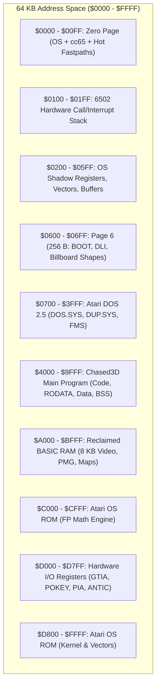

# RAM Management & Memory Architecture on the Atari 8-Bit (6502)

This document details the memory layout, hardware alignment rules, ROM banking, and linker configuration used to manage the 64 KB address space of the Atari 800XL / 130XE in Chased3D.

---

## 1. Atari 8-Bit Memory Architecture & Constraints

The MOS 6502 processor addresses a flat 64 KB ($0000–$FFFF) address space. In a standard Atari 8-bit system running Atari DOS 2.5, this address space is contested by the operating system, disk file management, memory-mapped I/O chips, and ROMs.



### Hardware Alignment & ANTIC DMA Restrictions

The ANTIC display co-processor shares system RAM via cycle-stealing Direct Memory Access (DMA). Because ANTIC's internal address counters have limited bitwidths, video structures must adhere to strict hardware alignment boundaries:

1. **4 KB Framebuffer Alignment**:
   ANTIC's internal memory scan counter is 12 bits wide ($000–$FFF). If a graphics mode framebuffer crosses any $1000 (4 KB) boundary, the high nibble does not increment; the counter wraps back to the start of the 4 KB page, corrupting the image. The 3D viewport framebuffer (`view_buffer`, 3,680 bytes) must therefore start at a 4 KB boundary ($A000).

2. **1 KB Display List Alignment**:
   Display lists cannot cross a 1 KB ($0400) boundary unless an explicit jump instruction (`$01`) is inserted. To keep display list structures simple and linear, display lists are pinned to dedicated 1 KB pages ($B000).

3. **1 KB Player-Missile Graphics (PMG) Alignment**:
   In single-line PMG resolution, the `PMBASE` hardware register holds the high byte of the PMG memory area. Because `PMBASE` only takes multiples of $0400, the 1,024-byte PMG array (`pmg_ram`) must be strictly 1 KB aligned ($B400).

---

## 2. Reclaiming the 8 KB BASIC ROM Window ($A000–$BFFF)

On Atari XL/XE computers, an 8 KB Microsoft-derived Atari BASIC ROM occupies the address window between $A000 and $BFFF. When BASIC is left enabled, user RAM is capped at $9FFF, leaving insufficient room for a high-resolution 3D raycaster alongside DOS 2.5.

### Hardware Bank Switching via PIA PORTB

The 6520 Peripheral Interface Adapter (PIA) controls system banking via `PORTB` ($D301):
* **Bit 1 = 0**: BASIC ROM is mapped into $A000–$BFFF.
* **Bit 1 = 1**: BASIC ROM is disconnected, revealing 8,192 bytes of underlying system RAM.

### The Boot Hook ([BOOT.ASM](BOOT.ASM))

Because the standard cc65 C runtime (`crt0`) reads OS `MEMTOP` ($02E5) during startup to place the downward-growing software stack, booting with BASIC active causes the C runtime to assume memory ends below $A000.

Chased3D overrides the binary run address in [chased3d.cfg](chased3d.cfg) using `runad = basic_off_start`. The assembly routine in [BOOT.ASM](BOOT.ASM) executes before cc65 initializes:

```ca65
basic_off_start:
        lda PBCTL
        ora #$04
        sta PBCTL
        lda PORTB
        ora #$02                   ; Disable BASIC ROM, enable RAM under ROM
        sta PORTB

        lda #<$BC20
        sta MEMTOP                 ; Raise OS MEMTOP to $BC20
        lda #>$BC20
        sta MEMTOP+1
        jmp start                  ; Jump to cc65 C runtime startup
```

By raising `MEMTOP` to `$BC20`, the C software stack and application heap are placed safely, making the full 8 KB window available for aligned video and game buffers.

---

## 3. Linker Configuration & Memory Layout

The memory map is declared in [chased3d.cfg](chased3d.cfg) and segmented across hardware and OS boundaries:

```mermaid
flowchart TD
    subgraph RECLAIMED["Reclaimed RAM Window ($A000 - $BFFF, 8 KB)"]
        direction TB
        B_SCREEN["BASICSCREEN: $A000 - $AFFF (4 KB)<br/>4K-aligned 3D Framebuffer (view_buffer)"]
        B_DLIST["BASICDLIST: $B000 - $B3FF (1 KB)<br/>1K-aligned Display Lists (view_dlist, splash_dlist, AUXBSS)"]
        B_PMG["BASICPMG: $B400 - $B7FF (1 KB)<br/>1K-aligned Player-Missile RAM (pmg_ram)"]
        B_HIGH["BASICHIGH: $B800 - $BFFF (2 KB)<br/>Maze Map, Row Tables, Minimap Bits, Height Table"]
    end

    subgraph MAINRAM["Main Program Area ($4000 - $9FFF)"]
        direction TB
        STARTUP["STARTUP / CODE: 6502 instructions"]
        RODATA["RODATA: Constants, sine tables, reciprocal tables"]
        DATA["DATA: Initialized mutable variables"]
        BSS["BSS: Static zero-initialized variables"]
        C_STACK["C Software Stack (1024 bytes, downward from $BC20 - $1C20)"]
    end
```



### Linker Memory Directive ([chased3d.cfg](chased3d.cfg))

```ld65
MEMORY {
    ZP:          file = "", define = yes, start = $0082, size = $007E;
    PAGE6:       file = %O, define = yes, start = $0600, size = $0100;
    MAIN:        file = %O, define = yes, start = %S,
                 size = $BC20 - __STACKSIZE__ - __RESERVED_MEMORY__ - %S;
    BASICSCREEN: file = "", define = yes, start = $A000, size = $1000;
    BASICDLIST:  file = "", define = yes, start = $B000, size = $0400;
    BASICPMG:    file = "", define = yes, start = $B400, size = $0400;
    BASICHIGH:   file = "", define = yes, start = $B800, size = $0800;
}
```

| Region | Start | Size | Purpose | Key Contents |
| :--- | :--- | :--- | :--- | :--- |
| `ZP` | `$0082` | 126 B | Application Zero Page | `dda_ptr`, `setup_ptr`, `rainbow_phase`, cc65 pseudo-registers |
| `PAGE6` | `$0600` | 256 B | Page 6 unbanked OS RAM | [BOOT.ASM](BOOT.ASM), [FLOORDLI.ASM](FLOORDLI.ASM), billboard sprite bitmaps |
| `MAIN` | `$4000` | $\approx 23.5\text{ KB}$ | Executable load area | Game code, trig tables ([trig3d.c](trig3d.c)), logic, sound, C stack |
| `BASICSCREEN` | `$A000` | 4,096 B | 4K-aligned video memory | 3D view buffer (`view_buffer`: 92 rows $\times 40\text{ bytes} = 3{,}680\text{ B}$) |
| `BASICDLIST` | `$B000` | 1,024 B | 1K-aligned ANTIC lists | `view_dlist`, `splash_dlist`, disk loading buffer `level_buffer` |
| `BASICPMG` | `$B400` | 1,024 B | 1K-aligned PMG DMA | Single-line Player-Missile Graphics buffer `pmg_ram` |
| `BASICHIGH` | `$B800` | 2,048 B | High game memory | `maze_map`, `maze_row_lo/hi`, `height_table`, `minimap_bits` |

---

## 4. Segment Placement in Source Code

Chased3D uses cc65 pragmas and ca65 assembly directives to steer specific variables into their designated hardware pages.

### Screen Buffer ([view3d.c](view3d.c#L50-L54))
```c
#pragma bss-name (push, "SCREEN")
unsigned char view_buffer[VIEW_STRIDE * VIEW_ROWS];
static unsigned char hud_line[40];
#pragma bss-name (pop)
```
Places `view_buffer` at $A000 so ANTIC can stream scanlines without 4 KB address wrap corruption.

### Display Lists & Disk Loading Buffer
* In [view3d.c](view3d.c#L56-L58):
  ```c
  #pragma bss-name (push, "DLIST")
  static unsigned char view_dlist[104];
  #pragma bss-name (pop)
  ```
* In [splash_screen.c](splash_screen.c#L18-L20):
  ```c
  #pragma bss-name (push, "DLIST")
  static unsigned char splash_dlist[VIEW_ROWS + 8];
  #pragma bss-name (pop)
  ```
* In [maze.c](maze.c#L7-L13):
  ```c
  #pragma bss-name (push, "AUXBSS")
  static unsigned char level_buffer[LEVEL_BUFFER_SIZE];
  static int level_file;
  static unsigned char level_buffer_pos;
  static unsigned char level_buffer_len;
  #pragma bss-name (pop)
  ```
  `AUXBSS` maps into `BASICDLIST` ($B000), utilizing spare bytes in the 1 KB page while disk I/O runs.

### Player-Missile Graphics Buffer ([sprite3d.c](sprite3d.c#L41-L43))
```c
#pragma bss-name (push, "PMGRAM")
static unsigned char pmg_ram[1024];
#pragma bss-name (pop)
```
Configures PMG memory at $B400 so `ANTIC.pmbase` can simply be loaded with `$B4`.

### High BSS Data Tables
* In [maze.c](maze.c#L15-L19):
  ```c
  #pragma bss-name (push, "HIGHBSS")
  unsigned char maze_map[MAZE_H][MAZE_W];
  unsigned char maze_row_lo[MAZE_H];
  unsigned char maze_row_hi[MAZE_H];
  #pragma bss-name (pop)
  ```
* In [view3d.c](view3d.c#L21-L23):
  ```c
  #pragma bss-name (push, "HIGHBSS")
  static unsigned char height_table[HEIGHT_STEPS];
  #pragma bss-name (pop)
  ```
Keeps large static lookup tables outside the lower `MAIN` memory block, maximizing space for code in `MAIN`.

### Page 6 Safe Execution Area ($0600–$06FF)
Page 6 is reserved by the Atari OS for user machine-language routines and is preserved across graphics mode resets:
* `PAGE6CODE`: Houses [BOOT.ASM](BOOT.ASM) and the Display List Interrupt handler in [FLOORDLI.ASM](FLOORDLI.ASM#L25).
* `PAGE6DATA`: Houses sprite billboard bit patterns in [sprite3d.c](sprite3d.c#L45-L66).

---

## 5. Memory Management Strategies: Static Allocation vs. Dynamic Heaps

Chased3D completely avoids dynamic heap allocation (`malloc()` / `free()`):

1. **Zero Heap Fragmentation**:
   Dynamic memory allocators on 8-bit CPUs introduce significant CPU overhead and fragmentation risks in constrained spaces. All buffers are fixed-size and statically allocated at link time.
2. **Deterministic Cache & Register Addressing**:
   Static allocation allows the compiler and assembler to generate direct 16-bit absolute addresses (`sta $xxxx`) and zero-page indirect addressing (`lda (ptr),y`) rather than software stack pointer offsets (`(sp),y`), saving thousands of clock cycles per frame.
3. **Hardware Page Sharing**:
   Transient states reuse memory safely. For instance, `level_buffer` shares `BASICDLIST` space because disk reading occurs when gameplay rendering is suspended.

---

## 6. Video DMA State & Interrupt Synchronization

When reconfiguring memory registers or swapping display lists, ANTIC DMA must be carefully gated to avoid memory bus conflicts or video crashes.

### Safe DMA Shutdown Pattern
Before resetting screen buffers or changing display lists (e.g. during splash screen transitions or level loads):
```c
OS.sdmctl = 0;       // Clear OS DMA shadow register
ANTIC.dmactl = 0;    // Immediately disable ANTIC DMA hardware fetch
```

### Staged Re-Enable Pattern
Re-enabling DMA follows a strict sequence:
1. **Point Display List**: Set `OS.sdlst` to the new display list address.
2. **Enable Playfield DMA**: Set `OS.sdmctl = 0x22` (standard width playfield + display list DMA).
3. **Install DLIs**: Write `NMIEN = 0xC0` to enable Display List Interrupts only after the display list is running.
4. **Enable PMG DMA**: Set `ANTIC.pmbase` to `$B4`, then update `OS.sdmctl = 0x2E` to activate Player-Missile DMA.

---

## 7. Linker Map Monitoring & Memory Budgeting

Every build triggers automated RAM validation through [report_free_ram.ps1](report_free_ram.ps1):

```powershell
& .\report_free_ram.ps1 -MapPath .\Chased3D.map
```

The script parses the segment map produced by `cl65` and reports headroom across both memory regions:

```text
Remaining free RAM: 5842 bytes (MAIN: 4210, BASICRAM: 1632; stack reserve: 1024)
```

* **MAIN Capacity**: $5C00 (23,552 bytes from $4000 to $9FFF).
* **BASIC RAM Capacity**: $2000 (8,192 bytes from $A000 to $BFFF).
* **C Stack Reservation**: 1,024 bytes (`__STACKSIZE__ = $0400`) reserved between `MAIN` and `MEMTOP`.

If either bank overflows, the build script fails immediately, ensuring memory bloat or unintended library inclusions are caught prior to testing on hardware or emulators.
