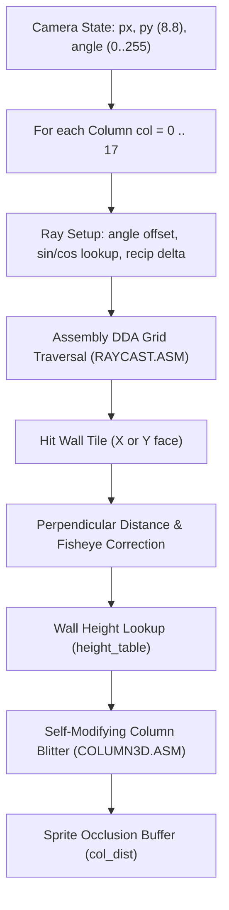
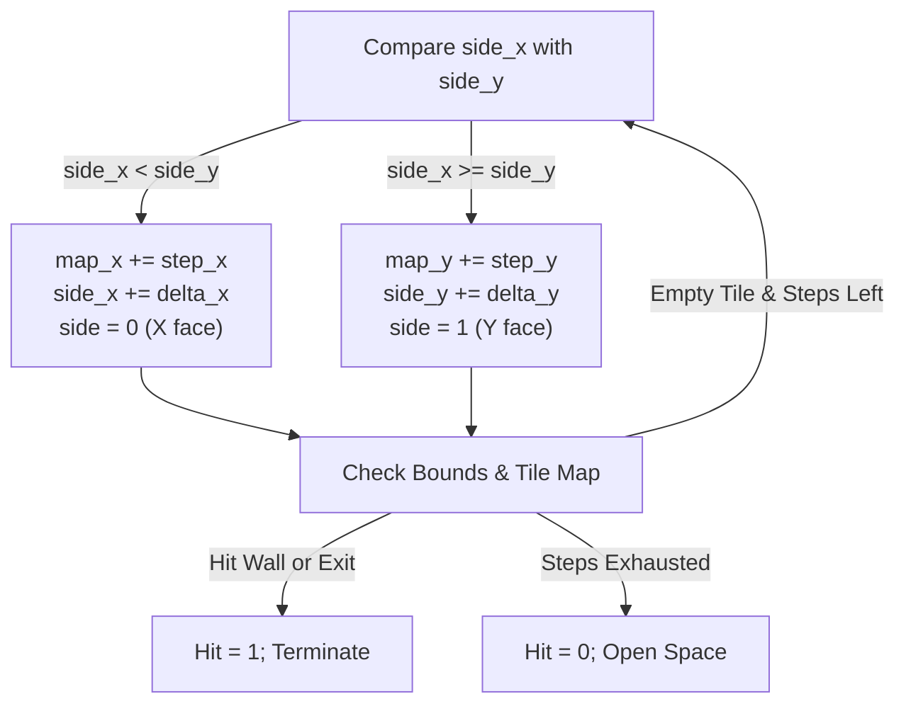

# Raycasting Algorithm on the Atari 8-Bit (6502)

This document provides a comprehensive technical overview of the real-time pseudo-3D raycasting engine implemented in Chased3D for the 8-bit Atari computers (Atari 800XL / 130XE).

---

## 1. System Constraints & Architecture Overview

Implementing 3D rendering on 1979-era hardware requires designing around severe hardware limitations:

* **CPU**: MOS 6502 running at $\approx 1.77\text{ MHz}$ (PAL) or $\approx 1.79\text{ MHz}$ (NTSC).
* **Instruction set**: 8-bit registers ($A, X, Y$), no hardware multiplication, no hardware division.
* **Frame budget**: At $20\text{–}25\text{ FPS}$, each frame has only $\approx 70{,}000\text{ to }90{,}000$ CPU cycles total, shared with ANTIC DMA and audio.
* **Graphics Mode**: ANTIC Mode D (OS Graphics 7):
  * Resolution: $160 \times 96$ pixels, 4 colors (2 bits per pixel).
  * Scanline stride: 40 bytes per row ($40 \text{ bytes} \times 4 \text{ pixels/byte} = 160 \text{ pixels}$).
  * Framebuffer size: $40 \times 92 \text{ rows} = 3{,}680\text{ bytes}$ for the 3D viewport.



---

## 2. Screen Layout & Column Optimization

A standard raycaster calculates and renders vertical stripes across the screen. In ANTIC Mode D, 4 pixels are packed into each byte. Modifying individual pixels requires reading, shifting, masking, and writing back screen memory.

To eliminate bitwise manipulation entirely:
* **Byte-aligned columns**: 1 ray column equals 2 screen bytes (8 horizontal pixels wide).
* **Viewport resolution**: 18 columns $\times 2\text{ bytes/column} = 36\text{ screen bytes}$ wide.
* **Dual-layout split**: The leftmost 5 bytes (20 pixels) display the 2D maze minimap, while the remaining 35 bytes contain the 3D first-person view.
* **Viewport height**: 92 rows centered on scanline row 46 (`HORIZON`).

Because each ray column writes entire bytes, rendering is reduced to streaming byte-wide color patterns directly into video memory.

---

## 3. Fixed-Point Mathematics & Lookup Tables

The engine uses 8.8 fixed-point arithmetic throughout:
* 1 grid cell width = 256 units ($1.0$).
* Coordinates: High byte = grid tile index; low byte = sub-cell fractional position ($0..255$).
* Angles: Binary Angle Measurement (BAM) where a full $360^\circ$ circle is divided into 256 steps ($0..255$). The 8-bit unsigned integer naturally wraps around without conditional checks or modulo operations.

The precomputed tables are generated offline by [gen_trig3d.py](gen_trig3d.py) and defined in [trig3d.c](trig3d.c):

1. **Sine and Cosine (`sin3d`)**:
   $$\text{sin3d}[i] = \text{round}(256 \times \sin(2\pi \cdot i / 256))$$
   Cosine is evaluated by shifting the phase index by 64 ($90^\circ$):
   $$\cos(\theta) = \text{sin3d}[(\theta + 64) \ \& \ 255]$$

2. **Reciprocals (`recip3d`)**:
   Calculates ray step intervals without runtime division:
   $$\text{recip3d}[m] = \min\left(16383, \left\lfloor \frac{65536}{m} \right\rfloor\right)$$

3. **Field of View (`ray_offset`)**:
   Calculates the angular deflection for each of the 18 columns spanning a $60^\circ$ horizontal FOV:
   $$\theta_{\text{offset}}[col] = (col + 0.5 - 9) \times \frac{60^\circ}{18}$$

4. **Fisheye Correction (`cos_rel`)**:
   Cosine of the relative ray angle:
   $$\text{cos\_rel}[col] = \text{round}(256 \times \cos(\theta_{\text{offset}}[col]))$$

---

## 4. Ray Setup & DDA Grid Traversal

Ray setup and stepping are implemented in 6502 assembly in [RAYCAST.ASM](RAYCAST.ASM) to avoid compiler stack overhead.

### Ray Setup

For each ray, the camera position $(px, py)$ and ray angle determine the delta step values:

$$\Delta x = \frac{1}{|\cos(\theta)|} = \text{recip3d}[|\cos(\theta)|]$$
$$\Delta y = \frac{1}{|\sin(\theta)|} = \text{recip3d}[|\sin(\theta)|]$$

The initial distance to the nearest grid line (`side_x` and `side_y`) is computed by multiplying the sub-tile fraction by the axis delta:

* Moving positive: $\text{fraction} = 256 - \text{position}_{\text{low}}$
* Moving negative: $\text{fraction} = \text{position}_{\text{low}}$
* Scaled side step:
  $$\text{side} = \frac{\text{fraction} \times \Delta}{256}$$

The multiplication is carried out by an 8-bit unrolled shift-and-add routine (`multiply_8x8` in [RAYCAST.ASM](RAYCAST.ASM#L213-L232)).

### DDA Stepping Loop

The Digital Differential Analyzer steps from cell boundary to cell boundary:



Grid cell lookups use precalculated row pointer arrays (`_maze_row_lo`, `_maze_row_hi` in [maze.c](maze.c#L16-L17)):
```ca65
ldy _dda_map_y
lda _maze_row_lo,y
sta dda_ptr
lda _maze_row_hi,y
sta dda_ptr+1
ldy _dda_map_x
lda (dda_ptr),y
```

This replaces 16-bit multiplications ($y \times \text{width}$) with single indirect indexed byte loads (`(dda_ptr),y`).

---

## 5. Distance Calculation, Shading & Height Projection

Once a ray strikes a wall (handled in [view3d.c](view3d.c#L155-L194)):

### 1. Distance Calculation
The raw Euclidean distance is determined by subtracting one delta step from the accumulated side distance:
$$d_{\text{raw}} = \begin{cases} \text{side}_x - \Delta x & \text{if X face hit} \\ \text{side}_y - \Delta y & \text{if Y face hit} \end{cases}$$

### 2. Fisheye Correction
Direct Euclidean distance causes walls to bulge outward at viewport edges. Multiplying by the precomputed cosine of the relative angle converts it to perpendicular distance:
$$d_{\text{perp}} = d_{\text{raw}} \times \cos(\theta_{\text{rel}})$$

In 8.8 fixed-point arithmetic:
```c
ray_mag = cos_rel[col];
ray_dist = ((ray_dist >> 8) * ray_mag)
         + (((ray_dist & 0x00FFu) * ray_mag) >> 8);
col_dist[col] = ray_dist;
```

The resulting `col_dist[col]` array doubles as a 1D depth buffer against which 3D sprites (such as the pursuer, targets, and projectiles in [sprite3d.c](sprite3d.c#L394)) perform depth testing.

### 3. Wall Height Projection
Perspective scaling requires dividing viewport height by distance:
$$h = \frac{\text{WALL\_SCALE}}{d_{\text{perp}}}$$

To avoid runtime division, Chased3D samples a precomputed 400-entry lookup table (`height_table` in [view3d.c](view3d.c#L22)):
```c
ray_height = height_table[ray_dist >> 4];
```

The top and bottom row coordinates on screen are:
$$y_{\text{top}} = \max\left(0, \frac{92 - h}{2}\right)$$
$$y_{\text{bottom}} = \min\left(91, y_{\text{top}} + h - 1\right)$$

### 4. Directional Shading
Flat shading creates depth contrast without texture mapping overhead:
* **X-facing walls**: Rendered in `PIX_WALL_X = 0xFF` (ANTIC 2-bit color 3 / COLPF2, bright luminance `0x0A`).
* **Y-facing walls**: Rendered in `PIX_WALL_Y = 0xAA` (ANTIC 2-bit color 2 / COLPF1, darker luminance `0x06`).

---

## 6. Self-Modifying Vertical Column Blitter

Writing a vertical stripe in raster graphics is typically slow because consecutive vertical pixels are separated by the scanline stride (40 bytes), requiring pointer updates for every pixel.

Chased3D solves this with an unrolled vertical blitter in [COLUMN3D.ASM](COLUMN3D.ASM):

1. **Unrolled Sequence**: An uninterrupted block of 92 absolute indexed stores:
   ```ca65
   asc_block:
       .repeat VIEW_ROWS, I
       sta _view_buffer + I * VIEW_STRIDE,x
       .endrepeat
       rts
   ```
2. **Computed Jump Table**: Because each `sta abs,x` instruction is exactly 3 bytes long, jumping to row $r$ is:
   $$\text{target} = \text{asc\_block} + 3 \times r$$
3. **Self-Modifying RTS Breakpoint**:
   To draw a wall stripe extending from row `top` to `bottom`:
   * Compute the jump address for `bottom + 1`.
   * Save the original instruction byte at that target.
   * Write an `RTS` (`$60`) opcode at that target.
   * Put column byte index in $X$ and wall color in $A$.
   * Jump indirect to `asc_block + 3 * top`.
   * Restore the original instruction byte.

This executes at the maximum memory bandwidth of the 6502 (5 cycles per row: `sta abs,x`), with zero overdraw and no loop branching overhead.

---

## 7. Dynamic Floor Shading via ANTIC Display List Interrupts

Instead of spending CPU cycles drawing floor textures:
* ANTIC Display List Interrupts (DLIs) are configured along floor scanlines ([FLOORDLI.ASM](FLOORDLI.ASM)).
* During the vertical electron beam sweep, DLIs fire at scheduled scanlines and modify the `COLPF0` color register on the fly.
* Floor color registers cycle through progressive luminance steps, producing horizontal perspective floor bands that shift with player movement ([view3d.c](view3d.c#L208-L225)).

---

## 8. Summary of Engineering Optimizations

| Component | Standard Implementation | Atari 8-Bit Optimization in Chased3D |
| :--- | :--- | :--- |
| **Angle arithmetic** | Floating-point degrees / radians | 256-step BAM wrapping automatically in 8-bit registers |
| **Trigonometry** | Hardware FPU / Taylor series | 256-byte lookup tables ([trig3d.c](trig3d.c)) |
| **Grid crossing** | Runtime division ($1 / \text{dir}$) | Precomputed reciprocal table `recip3d` |
| **Grid traversal** | Interpreted C DDA loop | Hand-crafted 6502 assembly loop ([RAYCAST.ASM](RAYCAST.ASM)) |
| **Map indexing** | Multiply $y \times \text{width} + x$ | Pointer lookup tables `_maze_row_lo` / `_maze_row_hi` |
| **Wall height** | Runtime division ($\text{scale} / \text{dist}$) | Distance lookup table `height_table` |
| **Pixel rasterization** | Bit masking and shifting | 2-byte columns written directly as whole bytes |
| **Column drawing** | Loop with pointer stride addition | Unrolled 92-row `sta abs,x` with self-modifying `RTS` |
| **Floor rendering** | Raycasted floor textures | Hardware ANTIC Display List Interrupt color cycling |
